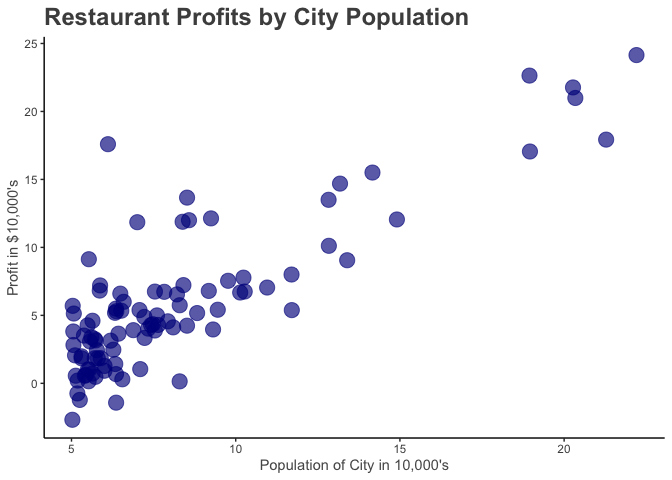
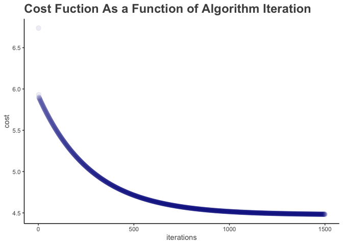
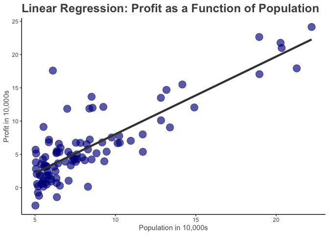
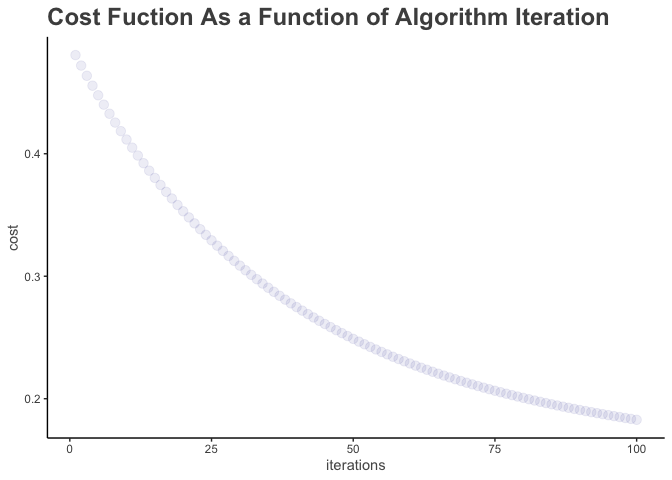

# Programming Exercise 1: Linear Regression   
This exercise is intended to replicate the first assignment in Andrew Ng's Machine Learning Coursera course using R rather than Matlab.  

All materials are modified from [Andrew Ng's Machine Learning course](https://www.coursera.org/learn/machine-learning/programming/8f3qT/linear-regression) on Coursera.

## Introduction  
In this exercise, I implement linear regression and demonstrate the model using data. 

Files relevant to this exercise (from Matlab):  

* ex1.m - Octave/MATLAB script that steps you through the exercise  
* ex1_multi.m - Octave/MATLAB script for the later parts of the exercise  
* ex1data1.txt - Dataset for linear regression with one variable  
* ex1data2.txt - Dataset for linear regression with multiple variables  
* submit.m - Submission script that sends your solutions to our servers  
* [$\star$] warmUpExercise.m - Simple example function in Octave/MATLAB 
* [$\star$] plotData.m - Function to display the dataset  
* [$\star$] computeCost.m - Function to compute the cost of linear regression  
* [$\star$] gradientDescent.m - Function to run gradient descent  
* [$\dagger$] computeCostMulti.m - Cost function for multiple variables  
* [$\dagger$] gradientDescentMulti.m - Gradient descent for multiple variables   
* [$\dagger$] featureNormalize.m - Function to normalize features  
* [$\dagger$] normalEqn.m - Function to compute the normal equations  

[$\star$] indicates files you will need to complete   
[$\dagger$] indicates optional exercises  


```r
population_profit <- read_csv("../data/ex1data1.txt", col_names = FALSE)
colnames(population_profit) <- c("population", "profit")
```

## Linear Regression With One Variable  
In this part of this exercise, I will implement linear regression with one variable to predict profits for a food truck. Suppose we are considering different cities for opening a new outlet for a restauraant franchise. The chain already has trucks in various cities and we have data for profits and populations from the cities.  

We will use this data to help you select which city to expand to next.  

The file ex1data1.txt contains the dataset for our linear regression problem. The first column is the population of a city and the second column is the profit of a food truck in that city. A negative value for profit indicates a loss.  

## Visualizing the Data  
Generating a scatterplot to better understand the data:  


```r
theme <- theme_classic() + 
            theme(plot.title = element_text(color = "gray30", size=18, face="bold"), 
                  axis.title.x = element_text(color = "gray34"),
                  axis.title.y = element_text(color = "gray34"))
population_profit %>%
  ggplot(aes(x = population, y = profit)) + 
  geom_point(color = "blue4", size = 5, alpha = 0.65) + 
  ggtitle("Restaurant Profits by City Population") + 
  ylab("Profit in $10,000's") + 
  xlab("Population of City in 10,000's") +
  theme
```

<!-- -->

## Gradient Descent  
In this part, we fit the linear regression parameters $\theta$ to our dataset using gradient descent.

The objective of linear regression is to minimize the cost function, 

$$J(\theta) = \frac{1}{2m}\sum_{i=1}^{m}(h_{\theta}(x^{(i)}) - y^{(i)})^2$$  

where the hypothesis $h_{\theta}(x)$ is given by the linear model

$$h_{\theta}(x) = \theta^{T}x = \theta_0 + \theta_1x_1$$
Recall that the parameters of the model are the $\theta_j$ values. These are the values used in minimizing cost $J(\theta)$. One way to do this is to use the batch gradient descent algorithm. In batch gradient descent, each iteration performs the update  

$$\theta_j := \theta_j - \alpha\frac{1}{m}\sum_{i=1}^{m}(h_{\theta}(x^{(i)}) - y^{(i)})x^{(i)}_{j}$$
With each step of gradient descent, the parameters $\theta_j$ come closer to the optimal values that will achieve the lowest cost $J(\theta)$.  

**Implementation Note:** We store each example as a row in the the X matrix. To take into account the intercept term $(\theta_0)$, we add an additional first column to X and set it to all ones. This allows us to treat $(\theta_0)$ as simply another ‘feature’.  


```r
# Add a column of ones to x
# initialize fitting parameters
x <- population_profit %>%
      mutate(bias = rep(1, nrow(.))) %>%
      select(bias, population)
X <- as.matrix(x)
head(X)
```

```
##      bias population
## [1,]    1     6.1101
## [2,]    1     5.5277
## [3,]    1     8.5186
## [4,]    1     7.0032
## [5,]    1     5.8598
## [6,]    1     8.3829
```

```r
y <- population_profit %>%
      select(profit)
y <- as.matrix(y)
theta <- as.matrix(rep(0, ncol(X)))
```

As we perform gradient descent to learn minimize the cost function $J(\theta)$, it is helpful to monitor the convergence by computing the cost. In this section, we will implement a function to calculate $J(\theta)$ to monitor the convergence of the gradient descent implementation.  

In the first example, we expect to see a cost of 32.07.  In the second, we expect to see an expected cost value of 54.24.


```r
costFunction <- function(X, theta, y){
  m <- nrow(y)
  predicted <- X %*% theta
  sum_square_err <- sum((predicted - y) ^ 2)
  j_theta <- sum_square_err / (2* m)
  return(j_theta)
}

costFunction(X, theta, y)
```

```
## [1] 32.07273
```

```r
theta2 = matrix(c(-1, 2), nrow = 2)
costFunction(X, theta2, y)
```

```
## [1] 54.24246
```


```r
num_iters <- 1500
alpha <-  0.01
cost <- rep(NA, num_iters)
  
gradientDescent <- function(X, y, alpha, iterations){
  theta <- as.matrix(rep(0, ncol(X)))
  m <- length(y)
  
  for(i in 1:iterations){
    predicted <- X %*% theta # 97x1 matrix
    theta <- theta - ((alpha / m) * (t(X) %*% (predicted - y)))
    cost[i] <- costFunction(X, theta, y)
  }
  return(list("theta" = theta, "cost" = cost))
}

# might want to define a convergence threshold and stopping criteria
model <- gradientDescent(X, y, alpha, num_iters)
```

The theta values are: $\theta_0$ = -3.6303 and $\theta_1$ = 1.1664. The cost is minimized at $J(\theta)$ = 4.4834.

We can observe how the cost function decreases with each iteration. 


```r
cost <- model[[2]]
iterations <- 1:num_iters
data <- tibble(iterations, cost)
data %>% ggplot(aes(x = iterations, y = cost)) +
  geom_point(color = "blue4", alpha = 0.075, size = 3) + 
  ggtitle("Cost Fuction As a Function of Algorithm Iteration") + 
  theme
```

<!-- -->

### Fitting the Model  

Let's see how well our parameters fit the data.  


```r
y_pred <- model[["theta"]][1] + model[["theta"]][2] * population_profit$population

p <- population_profit %>% ggplot(aes(population, profit)) +
  geom_point(color = "blue4", alpha = 0.65, size = 5)

p + geom_line(aes(x = population_profit$population, y = y_pred), size = 1.5, color = "grey25") + 
  theme +
  ggtitle("Linear Regression: Profit as a Function of Population") + 
  xlab("Population in 10,000s") + 
  ylab("Profit in 10,000s")
```

<!-- -->


## Linear regression with multiple variables  
Here we implement linear regression with multiple variables to predict the prices of houses. Suppose you are selling your house and you want to know what a good market price would be. One way to do this is to first collect information on recent houses sold and make a model of housing prices.  

The file ex1data2.txt contains a training set of housing prices in Portland, Oregon. The first column is the size of the house (in square feet), the second column is the number of bedrooms, and the third column is the price of the house.  


```r
home_prices <- read_csv("../data/ex1data2.txt", col_names = FALSE)
colnames(home_prices) <- c("sq_feet", "n_bedrooms", "price")
```

## Feature Normalization  
We will start by loading and displaying some values from this dataset. By looking at the values, note that house sizes are about 1000 times the number of bedrooms. When features differ by orders of magnitude, first performing feature scaling can make gradient descent converge much more quickly.  


```r
summary(home_prices)
```

```
##     sq_feet       n_bedrooms       price       
##  Min.   : 852   Min.   :1.00   Min.   :169900  
##  1st Qu.:1432   1st Qu.:3.00   1st Qu.:249900  
##  Median :1888   Median :3.00   Median :299900  
##  Mean   :2001   Mean   :3.17   Mean   :340413  
##  3rd Qu.:2269   3rd Qu.:4.00   3rd Qu.:384450  
##  Max.   :4478   Max.   :5.00   Max.   :699900
```

```r
head(home_prices)
```

```
## # A tibble: 6 x 3
##   sq_feet n_bedrooms  price
##     <dbl>      <dbl>  <dbl>
## 1    2104          3 399900
## 2    1600          3 329900
## 3    2400          3 369000
## 4    1416          2 232000
## 5    3000          4 539900
## 6    1985          4 299900
```
 To normalize the data, we:
 
1. Subtract the mean value of each feature from the dataset.  
2. After subtracting the mean, additionally scale (divide) the feature values by their respective “standard deviations.”  

The standard deviation is a way of measuring how much variation there is in the range of values of a particular feature (most data points will lie within ±2 standard deviations of the mean); this is an alternative to taking the range of values (max-min). 

**Implementation Note:** When normalizing the features, it is important to store the values used for normalization - the mean value and the standard deviation used for the computations. After learning the parameters from the model, we often want to predict the prices of houses we have not seen before. Given a new x value (living room area and number of bedrooms), we must first normalize x using the mean and standard deviation that we had previously computed from the training set.


```r
mean_sq_feet = mean(home_prices$sq_feet)
sd_sq_feet = sd(home_prices$sq_feet)
mean_n_bedrooms = mean(home_prices$n_bedrooms)
sd_n_bedrooms = sd(home_prices$n_bedrooms)
mean_price = mean(home_prices$price)
sd_price = sd(home_prices$price)
home_prices <- home_prices %>%
                      mutate(sq_feet_norm = (sq_feet - mean_sq_feet) / sd_sq_feet,
                             n_bedrooms_norm = (n_bedrooms - mean_n_bedrooms) / sd_n_bedrooms,
                             price_norm = (price - mean_price) / sd_price)
head(home_prices)
```

```
## # A tibble: 6 x 6
##   sq_feet n_bedrooms  price sq_feet_norm n_bedrooms_norm price_norm
##     <dbl>      <dbl>  <dbl>        <dbl>           <dbl>      <dbl>
## 1    2104          3 399900       0.130           -0.224     0.476 
## 2    1600          3 329900      -0.504           -0.224    -0.0841
## 3    2400          3 369000       0.502           -0.224     0.229 
## 4    1416          2 232000      -0.736           -1.54     -0.867 
## 5    3000          4 539900       1.26             1.09      1.60  
## 6    1985          4 299900      -0.0197           1.09     -0.324
```

```r
summary(home_prices)
```

```
##     sq_feet       n_bedrooms       price         sq_feet_norm    
##  Min.   : 852   Min.   :1.00   Min.   :169900   Min.   :-1.4454  
##  1st Qu.:1432   1st Qu.:3.00   1st Qu.:249900   1st Qu.:-0.7156  
##  Median :1888   Median :3.00   Median :299900   Median :-0.1418  
##  Mean   :2001   Mean   :3.17   Mean   :340413   Mean   : 0.0000  
##  3rd Qu.:2269   3rd Qu.:4.00   3rd Qu.:384450   3rd Qu.: 0.3376  
##  Max.   :4478   Max.   :5.00   Max.   :699900   Max.   : 3.1173  
##  n_bedrooms_norm     price_norm     
##  Min.   :-2.8519   Min.   :-1.3637  
##  1st Qu.:-0.2237   1st Qu.:-0.7239  
##  Median :-0.2237   Median :-0.3240  
##  Mean   : 0.0000   Mean   : 0.0000  
##  3rd Qu.: 1.0904   3rd Qu.: 0.3522  
##  Max.   : 2.4045   Max.   : 2.8750
```

## Gradient Descent  
Previously, we implemented gradient descent on a univariate regression problem. The only difference now is that there is one more feature in the matrix X. The hypothesis function and the batch gradient descent update rule remain unchanged.  

Using the code in computeCostMulti.m and gradientDescentMulti.m as a guide, we implement the cost function and gradient descent for linear regression with multiple variables. 

The code written for the univariate case supports any number of features and is well-vectorized. Let's try it out!


```r
# Add a column of ones to x
# initialize fitting parameters
x <- home_prices %>%
      select(sq_feet_norm, n_bedrooms_norm) %>%
      mutate(bias = rep(1, nrow(.))) %>%
      select(bias, sq_feet_norm, n_bedrooms_norm)
X <- as.matrix(x)
y <- home_prices %>%
      select(price_norm)
y <- as.matrix(y)
theta <- as.matrix(rep(0, ncol(X)))
head(X)
```

```
##      bias sq_feet_norm n_bedrooms_norm
## [1,]    1   0.13000987      -0.2236752
## [2,]    1  -0.50418984      -0.2236752
## [3,]    1   0.50247636      -0.2236752
## [4,]    1  -0.73572306      -1.5377669
## [5,]    1   1.25747602       1.0904165
## [6,]    1  -0.01973173       1.0904165
```


```r
alpha = 0.01
num_iters = 100
cost <- rep(NA, num_iters)

mv_model <- gradientDescent(X, y, alpha, num_iters)
```


The theta values are: $\theta_0$ = NA,  $\theta_1$ = NA, and  $\theta_2$ = NA. The cost is minimized at $J(\theta)$ = 0.1828.

We can observe how the cost function decreases with each iteration. 


```r
cost <- mv_model[[2]]
iterations <- 1:num_iters
data <- tibble(iterations, cost)
data %>% ggplot(aes(x = iterations, y = cost)) +
  geom_point(color = "blue4", alpha = 0.075, size = 3) + 
  ggtitle("Cost Fuction As a Function of Algorithm Iteration") + 
  theme
```

<!-- -->


Let's see what our model prdicts given a new data point, a three-bedroom home with 1650 square feet:  


```r
# Predicted price of a 1650 sq-ft, 3 br house
n_bedrooms = 3
sq_ft = 1650
one_home <- as.matrix(tibble(bias = 1, bedrooms = (n_bedrooms - mean_n_bedrooms) / sd_n_bedrooms, sq_feet = (sq_ft - mean_sq_feet) / sd_sq_feet))

predicted_normalized <- one_home %*% mv_model[[1]] 
predicted <- (predicted_normalized *  sd_price) + mean_price
```

A three-bedroom, 1650 square foot house has a predicted price of $317,736

Let's do a sanity check. Looking at the training data,  


```r
home_price_summary <- home_prices %>% group_by(n_bedrooms) %>% summarise(mean(price), mean(sq_feet))
home_price_summary
```

```
## # A tibble: 5 x 3
##   n_bedrooms `mean(price)` `mean(sq_feet)`
##        <dbl>         <dbl>           <dbl>
## 1          1       169900            1000 
## 2          2       280867.           1496.
## 3          3       326404.           1839.
## 4          4       377450.           2400.
## 5          5       699900            4478
```
we see that the average price for a three-bedroom home is $326,403. The average square footage is around 1838 square feet. So that our predicted price is just under the mean seems to make sense here.

## Normal Equations  
The closed-form solution to linear regression is  

$\theta = (X^TX)^{-1}X^Ty$  

Using this formula does not require any feature scaling, and you will get an exact solution in one calculation: there is no “loop until convergence” like in gradient descent.
Complete the code in normalEqn.m to use the formula above to calculate $\theta$. Remember that while you don’t need to scale your features, we still need to add a column of 1’s to the X matrix to have an intercept term ($\theta_0$). 


```r
x <- home_prices %>% 
      mutate(bias = rep(1, nrow(.))) %>%
      select(bias, sq_feet, n_bedrooms)
y <- home_prices %>% 
      select(price)
X <- as.matrix(x)
y <- as.matrix(y)
theta <- solve(t(X) %*% X) %*% t(X) %*% y
print(theta)
```

```
##                 price
## bias       89597.9095
## sq_feet      139.2107
## n_bedrooms -8738.0191
```

Using out parameters found throught the normal equation, we'll make the same price prediction for a 1650-square-foot house with 3 bedrooms. 


```r
one_home <- as.matrix(tibble(bias = 1, sq_feet = sq_ft, bedrooms = n_bedrooms))
predicted <- one_home %*% theta
```

Here, we estimate a three-bedroom, 1650 square foot house has a predicted price of $293,081
